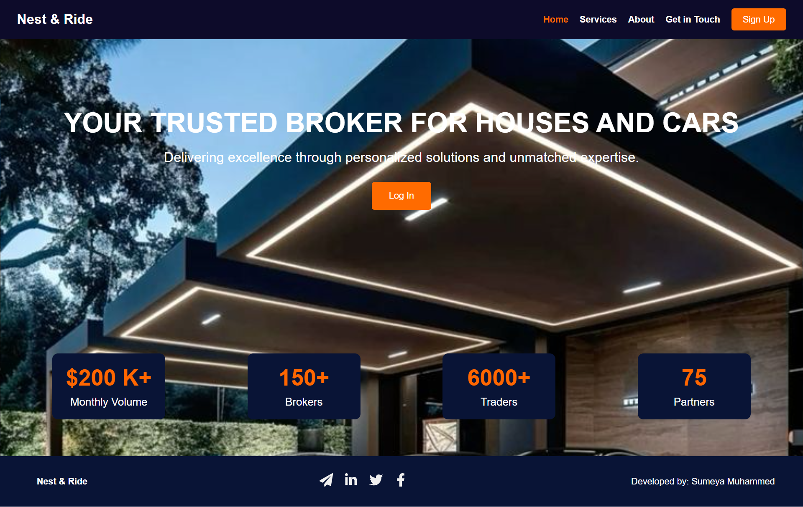
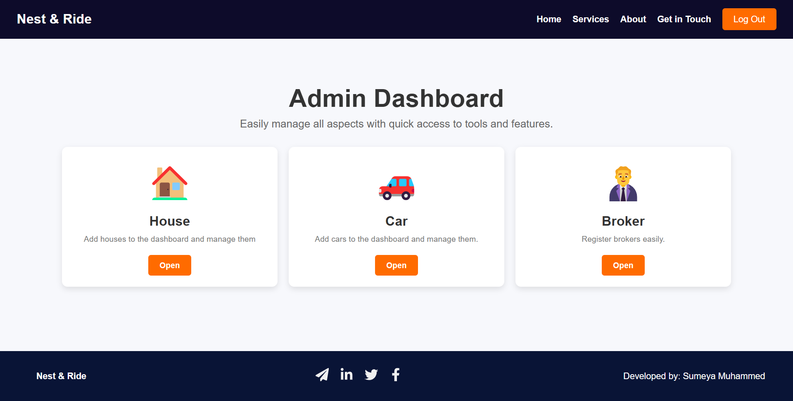
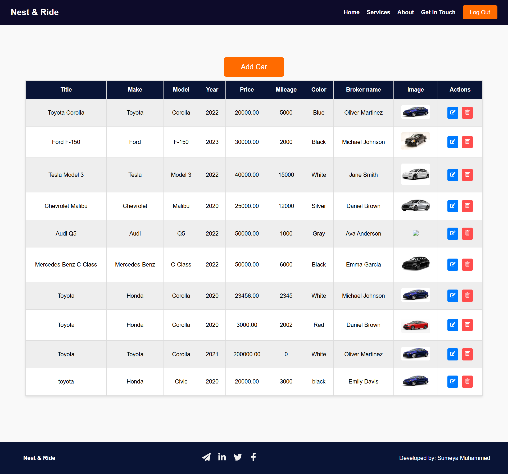
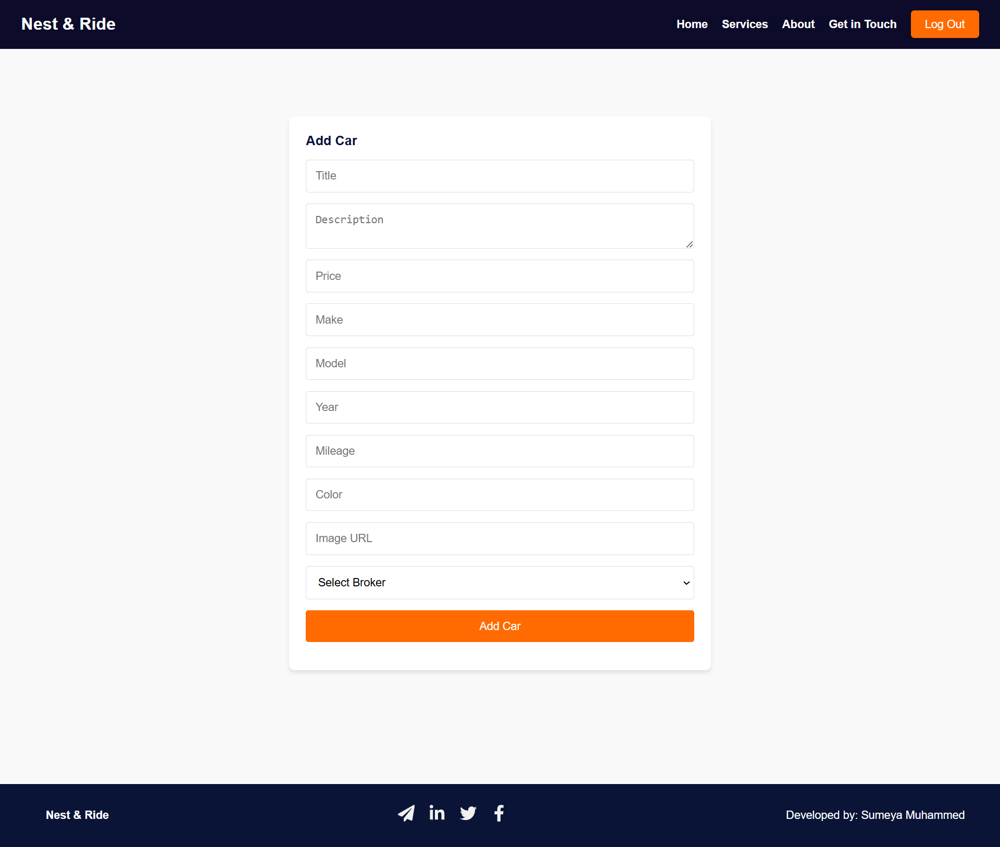
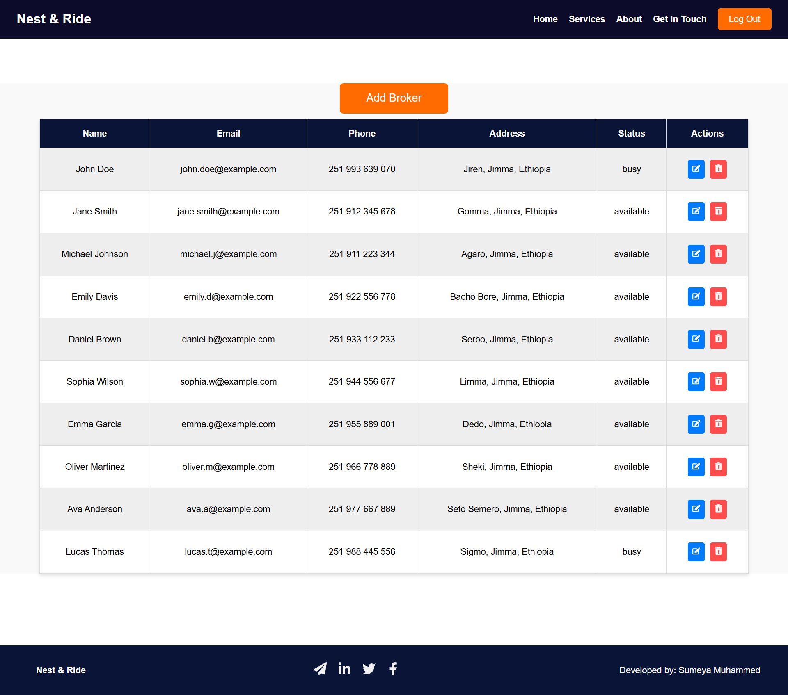
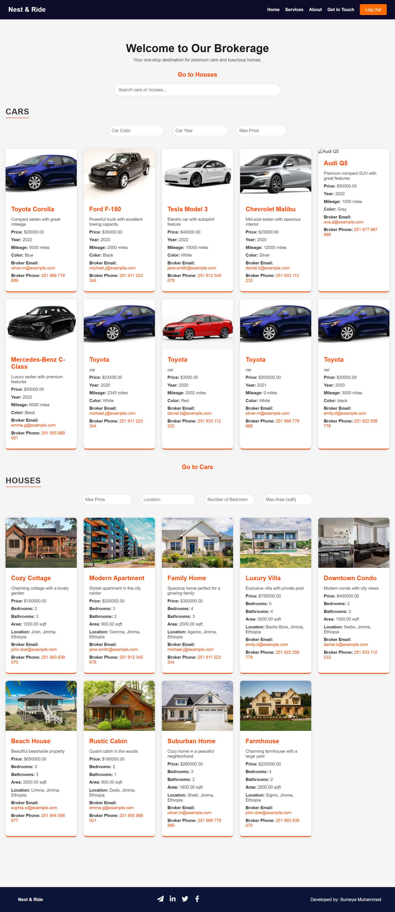

# Nest and Ride Brokerage

## Description
Nest and Ride Brokerage is a web application designed to facilitate the buying, selling, and renting of properties. The application provides a user-friendly interface for both brokers and clients, allowing them to manage listings, view property details, and connect with each other seamlessly.

## Features
- User authentication and authorization
- Admin dashboard for managing brokers and properties
- Add, edit, and delete property listings
- Image uploads for property listings
- Responsive design for mobile and desktop users
- Search functionality for properties
- Detailed views for each property

## Screenshots

*This is the landing page of the application, showcasing its purpose and welcoming users.*


*The admin dashboard allows administrators to manage brokers and property listings.*


*This screen shows the interface for managing car listings, including editing and deleting options.*


*The add car page enables admins to add new car listings with all necessary details and images.*


*This page provides tools for administrators to manage broker information and assignments.*


*The add broker interface allows admins to onboard new brokers to the platform.*


*The user dashboard displays property listings with filtering options and detailed views.*

## Installation
To get started with the project, follow these steps:

1. Clone the repository:
   ```bash
   git clone https://github.com/yourusername/nest-and-rest-brokerage.git
   cd nest-and-rest-brokerage
   ```

2. Install backend dependencies:
   ```bash
   cd backend
   npm install
   ```

3. Install frontend dependencies:
   ```bash
   cd ../client
   npm install
   ```

## Usage
To run the application, follow these steps:

1. Start the backend server:
   ```bash
   cd backend
   node app.js
   ```

2. Start the frontend application:
   ```bash
   cd ../client
   npm run dev
   ```

3. Open your browser and navigate to `http://localhost:5173` to access the application.

### Logging In
- **Admin Login**: Use the following credentials to log in as an admin:
  - Username: `sumeya`
  - Password: `sumina4567`
  
- **User Login**: Use the credentials provided during registration to log in as a user. After logging in, you will be directed to the dashboard where you can manage properties.

### Navigating the Application
- When navigating to the admin dashboard, you can choose to manage cars, houses, or brokers.
- If logged in as a user, you will have an access to detailed views for each property.

## .env Configuration
To access the database, ensure your `.env` file contains the following settings:

```
DB_HOST=localhost
DB_USER=brokerage
DB_PASSWORD=@tWeO70-eE4JyO6
DB_NAME=brokerage
DB_PORT=3306
JWT_SECRET=NEXHXsMOS7Yj536kxccj834jhrCQxuNzr9EpLa6YVGHO
```

## Contributing
Contributions are welcome! Please follow these steps to contribute:

1. Fork the repository.
2. Create a new branch for your feature or bug fix.
3. Make your changes and commit them.
4. Push your changes to your forked repository.
5. Create a pull request.

## License
This project is licensed under the MIT License. See the [LICENSE](LICENSE) file for details.

## Contact Information
For any inquiries or support, please contact:
- Sumeya Muhammed - [sumenaweya@gmail.com](mailto:sumenaweya@gmail.com)
- GitHub: [SumeyaMuhammed](https://github.com/SumeyaMuhammed)
- LinkedIn: [Sumeya Muhammed](https://www.linkedin.com/in/sumeya-muhammed-a83168319/)

